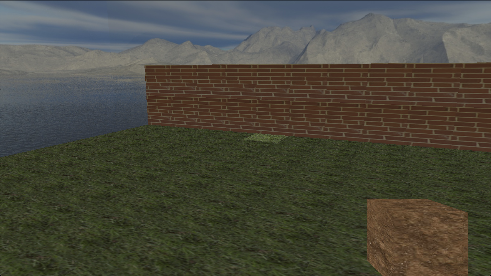

# Welcome to CubeWorld!

This is an OpenGL learning project in which I have created an interactive voxel-based environment in the vein of Minecraft. The program utilizes the Phong lighting model for an immersive day-night cycle, and allows for player interaction with the world through keyboard and mouse.

CubeWorld introduces the concept of "sentient cubes," which appear similar to the building blocks of the environment, but each have unique behaviors based on their texture:

```
Path Placer (stone)   - Randomly builds paths in a roaming pattern. Will path away from the player if attacked.

Brick Builder (brick) - Randomly builds 3-high walls around the environment. Will path in a straight line from the player if attacked.

Ground Grower (grass) - Builds ground in strips with varying height (based on Perlin noise). Ignores attacks from players

BlockBreaker (void)   - Will remove the block nearest to it, or path to a block. Chases the player if attacked, trying to break the block below the player's feet.

```

## Setup:


### Install SDL2:

I used the following tutorial: https://www.youtube.com/watch?v=V6ACATpl2LQ&list=PLvv0ScY6vfd-p1gSnbQhY7vMe2rng0IL0&index=5&ab_channel=MikeShah

### Building and running

```
$ git clone https://github.com/samphillippo/cube-world.git
$ cd cube-world
$ python3 build.py
$ ./project
```

## Controls

```
W           - move forward
A           - move to the left
S           - move backward
D           - move to the right
SPACE       - jump/climb
Left-click  - break block/attack
Right-click - place block
1-4         - select block
F           - enter/exit no-clip mode
P           - pause/unpause world ticks
R           - reset time
ESC         - quit game
```


## Alpha Demo (outdated)

https://www.youtube.com/watch?v=jmFsiIWcYa8

## Screenshots




